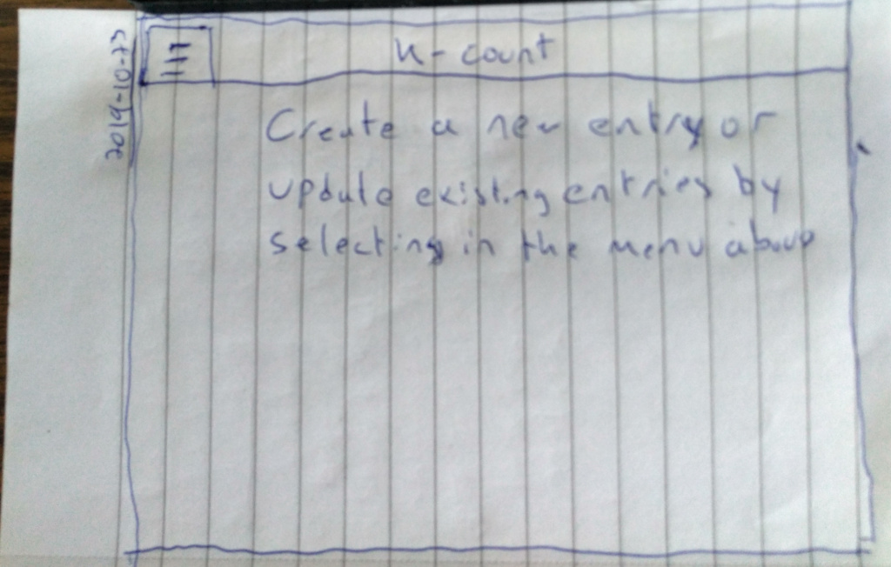
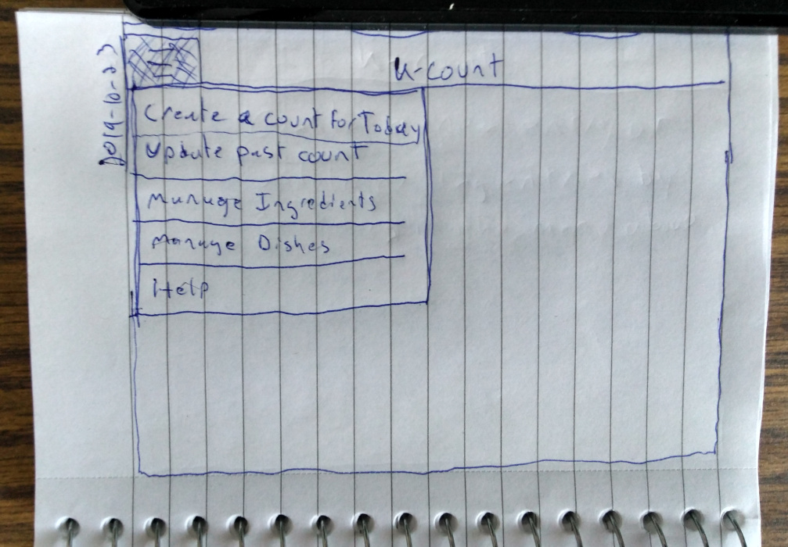
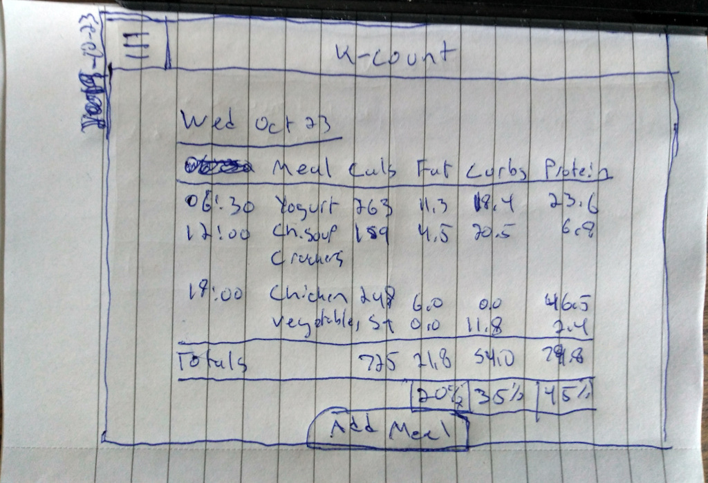
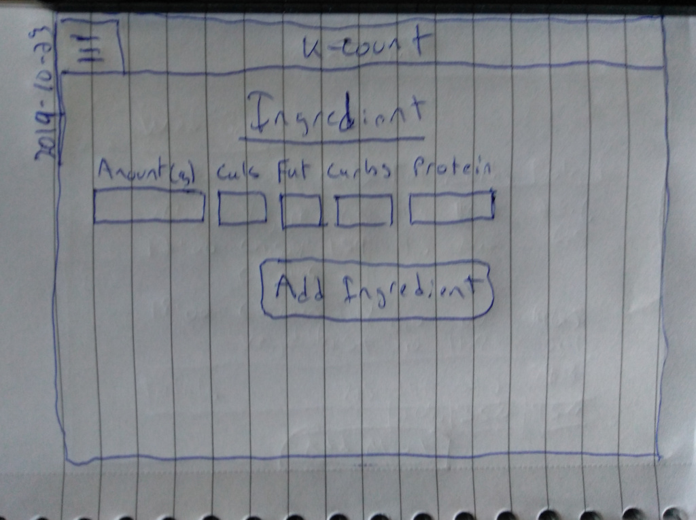
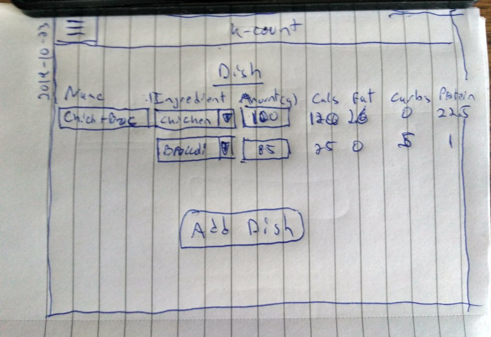

# k-count
An application to count daily calorie consumption. Users add the foods they eat. The application displays the daily breakdown of calories, fat, carbohydrates, and protein consumed. 

Application Website: https://agile-savannah-53997.herokuapp.com

## Screen Sketches
**Main Screen**

**Menu**

**Meal Screen**

**Ingredient Screen**

**Dish Screen**

## Business Rules
* On opening the application, display the daily calorie table if one exists. If not display a message to create one for the day or update an existing date
* Display a table of the breakdown of daily calories, fats, carbs and protein
    * Each row contains an item showing the time of consumption, calories, fats, carbs and protein
    * Bottom of the table will display the percentage of fats, carbs and protein
* Create a table **meal**
    * A meal entry consists of time, meal name, calories, fats, carbs and protein
    * A meal can have multiple dishes and is determined by time
* Add a meal entry
    * Item name uses a selection box filled with dishes or a user entered name
* Update a meal entry
    * User can change the amounts when data is diplayed
* Create a table **ingredients**
    * Ingredients consist of the nutrtion facts
* Create a table **dish**
    * A dish contains multiple ingredients and the amount for the dish
* The meal table is not linked to the dish table. When a meal is created from multiple dishes it stores the values of the dish at the time. If the dish values are changed later it does not affect the meal values. This is done for when serving size (amount of ingredient in a dish) is changed - it doesn't change what was served prior.
* Update an ingredient entry
* Update a dish entry